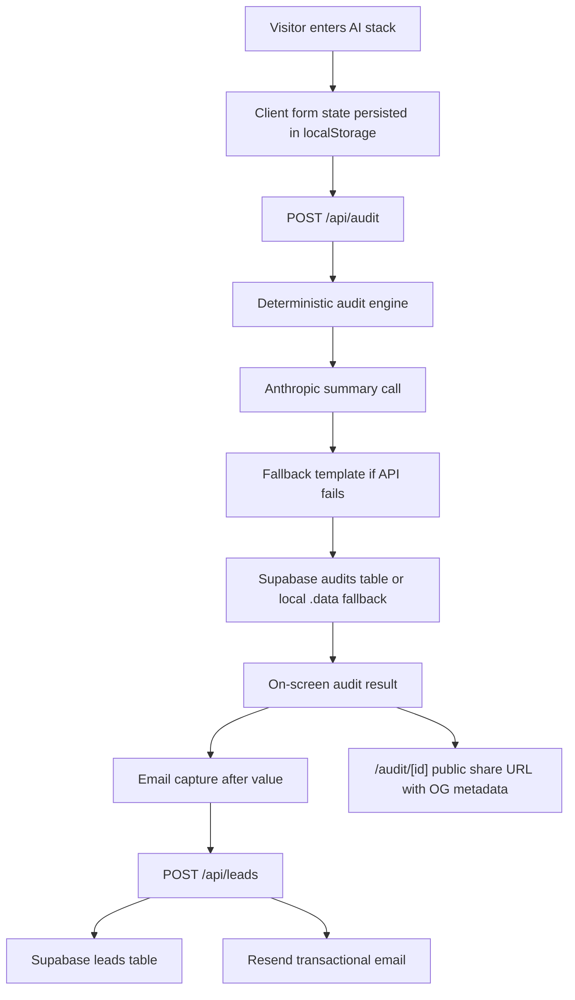

# Architecture

## Data Flow

The browser stores the unfinished form in `localStorage`, then posts `teamSize`, `useCase`, and rupee-denominated tool rows to `/api/audit`. The server runs `auditSpend`, asks Anthropic only for a short prose summary, falls back to a template if the API fails, stores the anonymized audit result, and returns it. The lead form appears after the result and posts contact details to `/api/leads`; public audit URLs never include email or company fields.

## Stack Choice

I chose Next.js with TypeScript because this product needs a polished React UI, server API routes, dynamic share pages, and Open Graph metadata in one deployable unit. The audit engine is plain TypeScript so it can be tested without rendering React. Supabase and Resend are integrated through REST calls to avoid committing SDK-specific setup or secrets.

## 10k Audits/Day

At 10k audits/day I would move rate limiting to Upstash Redis or Cloudflare Turnstile, make Supabase the only storage path, add a queue for Resend, cache pricing data as versioned records, and log recommendation outcomes for analysis. The audit engine can stay synchronous, but summary generation should become async with a short timeout so LLM latency never blocks the core result.
