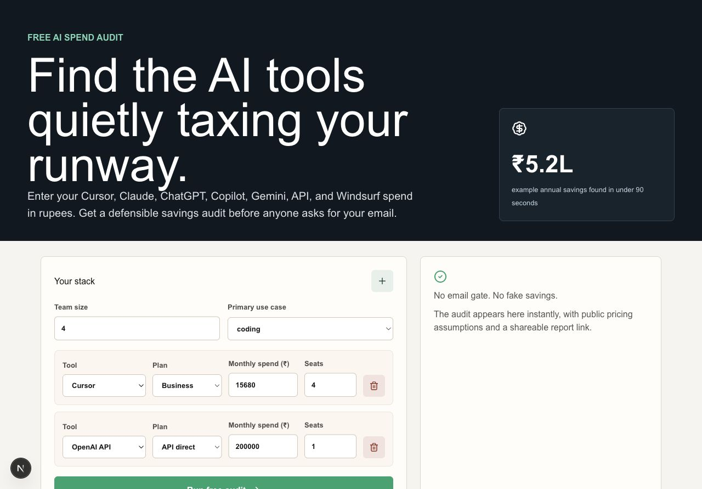
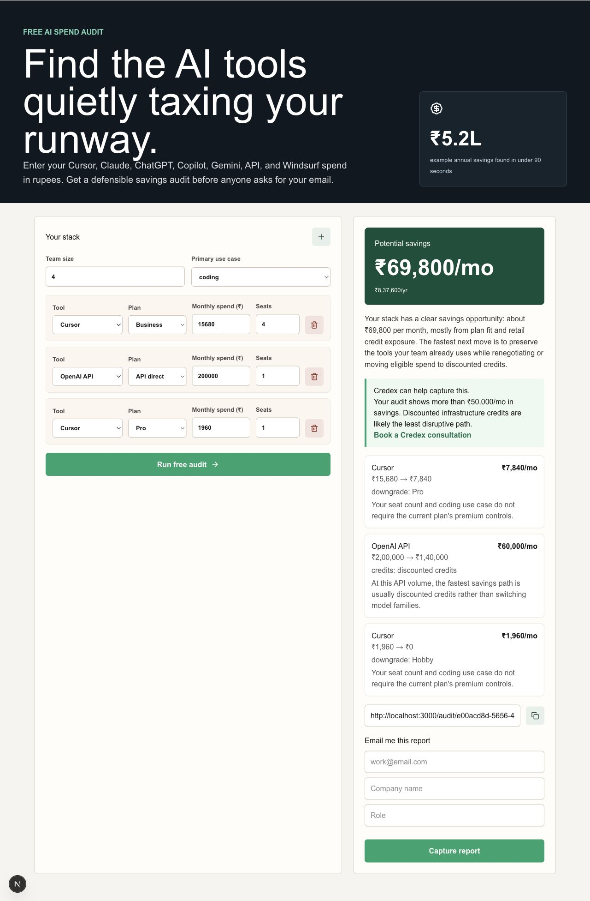
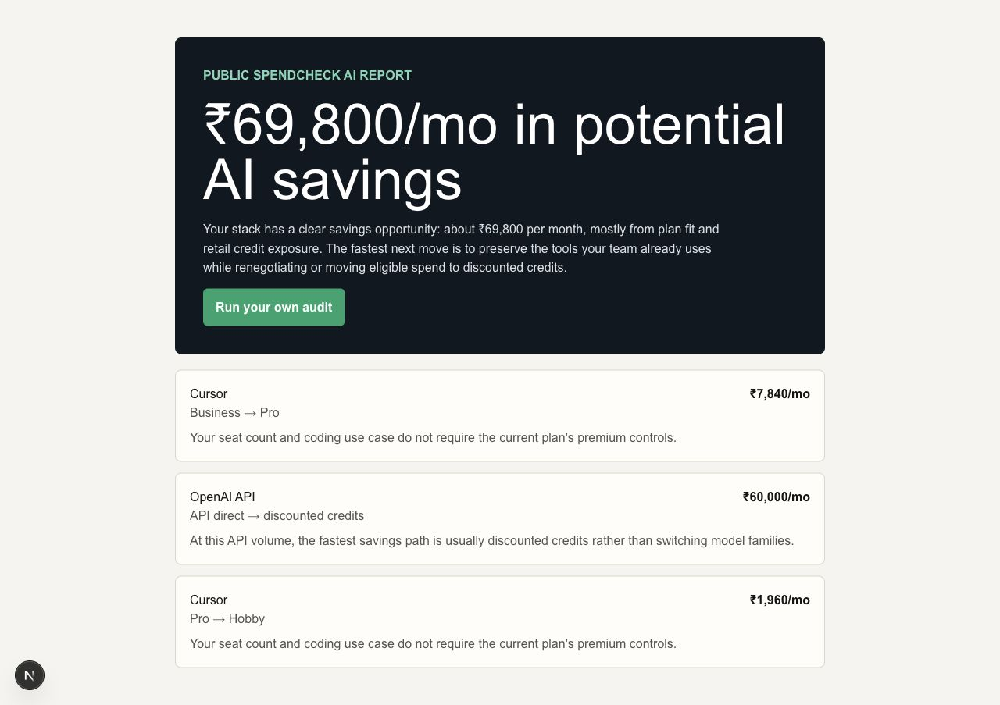

# SpendCheck AI

SpendCheck AI is a free AI tool-spend audit for Indian startup founders and engineering managers. It benchmarks Cursor, Claude, ChatGPT, Copilot, Gemini, API, and Windsurf spend in rupees, then shows plan-fit recommendations and Credex credit opportunities without requiring login or email before value.

Live URL: https://credex-submission.vercel.app

## Screenshots

These screenshots are from the local verified build. Replace with deployed screenshots or a 30-second Loom/YouTube walkthrough after production deploy:





## Quick Start

```bash
npm install
npm run dev
npm test
npm run lint
```

Deploy on Vercel or Netlify and set these optional environment variables:

- `NEXT_PUBLIC_SITE_URL`
- `ANTHROPIC_API_KEY`
- `ANTHROPIC_MODEL`
- `SUPABASE_URL`
- `SUPABASE_SERVICE_ROLE_KEY`
- `RESEND_API_KEY`
- `RESEND_FROM_EMAIL`

For Supabase, run `supabase/schema.sql` before enabling `SUPABASE_URL` and `SUPABASE_SERVICE_ROLE_KEY`.

## Decisions

- Email is gated after the audit result because the product has to earn trust before lead capture.
- Audit math is deterministic TypeScript, not LLM-generated, so rupee-denominated pricing recommendations are explainable and testable.
- LLM usage is limited to a summary paragraph; failures fall back to templated copy.
- Supabase and Resend are env-driven so secrets never land in git and local development still works with `.data` files.
- Abuse protection uses an in-memory rate limit plus a honeypot field for MVP simplicity; production should move rate limits to Redis or edge middleware.
